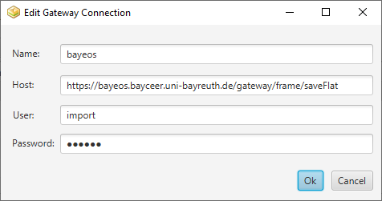

# BayEOS Logger FX User Guide
Released 2018-05-16

<!-- @import "[TOC]" {cmd="toc" depthFrom=1 depthTo=6 orderedList=false} -->

<!-- code_chunk_output -->

* [About](#about)
* [Installation](#installation)
	* [Prerequisites](#prerequisites)
	* [Windows](#windows)
	* [Linux](#linux)
	* [Mac](#mac)
* [First Time Configuration](#first-time-configuration)
* [Main Tasks](#main-tasks)
	* [Data Download](#data-download)
	* [Data Upload](#data-upload)
	* [Live Mode](#live-mode)
* [Logger Configuration](#logger-configuration)
* [Troubleshooting](#troubleshooting)
	* [No serial device found](#no-serial-device-found)
	* [Using an internal SD card file](#using-an-internal-sd-card-file)

<!-- /code_chunk_output -->

## About 
BayEOS Logger FX is a utility to transfer data from BayEOS Loggers to a [BayEOS Gateway](http://https://github.com/BayCEER/bayeos-gateway). It plays the role of a staging area between your field site and the gateway. You can use it to download data from a logger, store it temporary and send it to a remote BayEOS gateway afterwards. A live mode enables you to verify the health status of all connected sensors.

## Installation

### Prerequisites 
- Internet access to download drivers
- Administrative privileges
- PC system clock is synchronized with a NTP time server

### Windows
1. Download and unpack the [logger software](http://www.bayceer.uni-bayreuth.de/edv/bayeos/bayeos-logger-fx.zip)
1. Download and install the latest [JRE (version >=8)](http://www.java.com/)
1. Connect your PC with a logger using a USB cable
1. Wait until the device driver is installed
1. Open the device manager (right click on start/device manager) and search for a new USB Serial Port. Mark the port number.  

1. Create a new link to BayEOS-Logger.exe on your desktop
1. Open the new link 

### Linux
1. Download and unpack the [logger software](http://www.bayceer.uni-bayreuth.de/edv/bayeos/bayeos-logger-fx.zip)
1. Login with root privileges and download the latest [JRE (version >=8)](http://www.java.com/) software
1. Extract the tar file to the default JRE location e.g. /usr/lib/jvm/jre8
1. Install the new JRE alternative: 
``update-alternatives --install /usr/bin/java java /usr/lib/jvm/jre8/bin/java 1``
1. Set the default JRE:
``update-alternatives --config java``
1. Add yourself to the dialout group:
``sudo usermod -aG dialout <username>``
Replace ``<username>`` with your personal system user name
1. Connect your PC with a logger to install the required USB Serial device driver. Your OS should inform you that a new serial device called FT232R USB UART was found
1. Figure out the logger device by a grep for "ttyUSB" on dmesg
1. Mark the device 
1. Start ``bayeos-logger-fx<version>.jar`` with a mouse click 

### Mac
1. Download and unpack the [logger software](http://www.bayceer.uni-bayreuth.de/edv/bayeos/bayeos-logger-fx.zip)
1. Login with root privileges and download the latest [JRE (version >=8)](http://www.java.com/) software
1. Start ``bayeos-logger-fx<version>.jar`` with a mouse click 

## First Time Configuration
1. Start the application 
1. Open the File → Preferences menu and activate the upload tab
2. Add a new connection to your destination gateway. The connection information like hostname, username and password is delivered by your BayEOS provider. A typical gateway destination configuration looks like this:

## Main Tasks

### Data Download
1. Connect your PC with the logger 
1. Start the BayEOS Logger FX application by clicking the desktop icon
1. Press the `Connect` button
1. Choose the serial port and baudrate (38400) and press `connect`:  
)
1. The main window shows the logger meta information  

1. Press the download button  
1. Choose `New` to download all new records since your last download:  

1. Press the `OK` to start the data download task
1. The data is downloaded and a new dump record can be found on the dumps tab:  

1. Press `Disconnect` and disconnect the logger cable or close the Bluetooth connection
1. You are now ready to upload the data to a BayEOS Gateway

### Data Upload
1. Be sure that your PC is connected to the internet and the 
BayEOS gateway can be accessed
1. Start the BayEOS Logger FX application  
1. Select the dump record to upload on the `Dumps` tab
1. Press the upload button  to send the data to the gateway
1. The dump record is deleted after a successful upload 

### Live Mode 
The live mode allows you to verify the sensor data in situ. It can be activated on an already connected logger by clicking the `Start` button on the live tab. The data is shown as it is received from the BayEOS board. Data logging is not stopped during live mode. Please press the `Stop` button to turn the live mode off.  

## Logger Configuration
You can configure your logger on the main logger tab to set the logger:
**Name**: A string to identify your logger on a destination gateway (mandatory)
**Sampling interval**: interval to save sensor values in secs (mandatory).
**Current time**: current logger time (mandatory), can be synced with your local PC time

## Troubleshooting

### No serial device found 
- Verify that your USB connector fits completely into the jack
- Check the [FTDI Driver](http://www.ftdichip.com/FTDrivers.htm) installation
- Check the logger battery

### Using an internal SD card file
In case of an emergency, e.g. a damaged logger, the internal Micro SD card can be used for recovery.
Please step through the following tasks to import the logger data from SD card:
1. Open the logger box and release the card 
2. Take the SD card and put it in a local SD card reader on your PC
3. Start the BayEOS Logger FX Application
4. Call the Import button on tab `Dumps`
5. Select the file BAYEOS.DB on your card drive
6. Specify the board name e.g. DE-METEOBOX
7. Press OK to import
8. The file data is imported as a new dump record and can be uploaded like any other dump file

